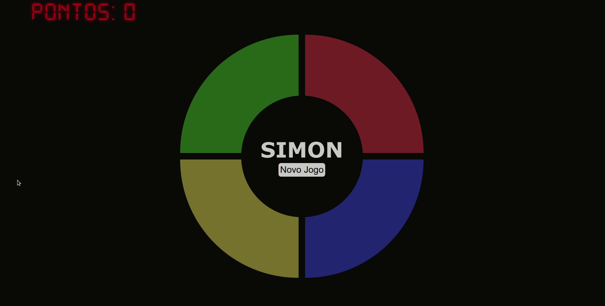

# genius-game



<br>

## Tabela de Conteúdos

- [Sobre](#about)
- [Rodando localmente](#getting_started)


<br>

## Sobre <a name = "about"></a>

Este Repositório contem os arquivos do jogo 'Genius', desenvolvido para o desafio do bootcamp Eduzz Fullstack Developer ministrado pela DIO.me.

<br>

## Rodando localmente <a name = "getting_started"></a>

### Download

What things you need to install the software and how to install them.

```bash
git clone https://github.com/FelipeJozala/genius-game.git
```
ou faça o download do repositório:  [Genius game (ZIP)](https://github.com/FelipeJozala/genius-game/archive/refs/heads/master.zip)


### Entre no diretório do projeto:

```bash
cd genius-game
```
### Instale as dependências

```bash
npm install
```

